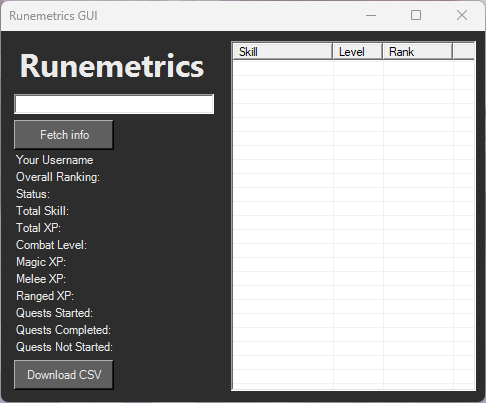

# RuneMetrics PowerShell GUI
A PowerShell-based GUI for interacting with the RuneMetrics API. View player stats, track progress, and explore RuneScape 3 data through a simple desktop interface.

This tool provides a simple desktop interface for retrieving and exploring player skill levels, experience, and other account data.

# Features

- Fetch RuneScape 3 player stats from RuneMetrics
- Simple PowerShell-based graphical interface
- Display skill levels and experience
- Quick player lookup
- Lightweight and easy to run
- No external dependencies beyond PowerShell

# Screenshot



# Requirements

- Windows
- PowerShell 5.1 or newer
- Internet connection

# Installation

Option 1 - Clone the repository

```
git clone https://github.com/yourusername/runemetrics-powershell-gui.git
cd runemetrics-powershell-gui
```

Option 2 - Download ZIP

1. Download the repository as a ZIP
2. Extract it
3. Open the folder

# Running the Application

Open PowerShell and run:

```
.\RuneMetricsGUI.ps1
```

# Usage

1. Launch the script
2. Enter a RuneScape 3 username
3. Click fetch info
4. The GUI will display the player's stats retrieved from RuneMetrics

# API
This project uses the public RuneMetrics API. See the wiki for more information: https://runescape.wiki/w/Application_programming_interface#Runemetrics
